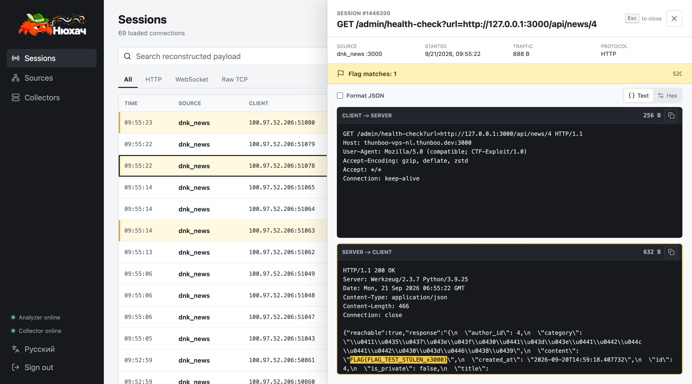
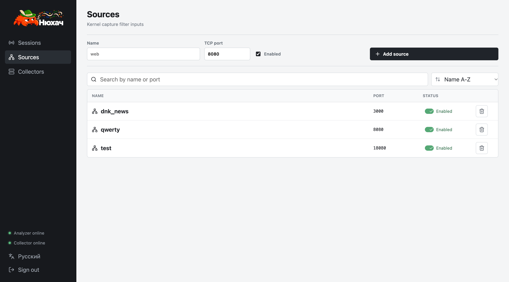

# Нюхач

`newhatch` is a lightweight live-traffic analyzer for Attack/Defence CTF competitions. The user-facing name is **Нюхач**.



See [PROJECT.md](PROJECT.md) for the product brief, current implementation and architectural constraints. Detailed design documents live in [`docs/`](docs/).

## Login Setup

Create `.env` and set the login credentials:

```bash
cp .env.example .env
```

```env
NEWHATCH_USERNAME=admin
NEWHATCH_PASSWORD=admin123
SESSION_EXPIRACY=86400s
AUTH_ALLOWED_SUBNETS=100.0.0.0/8
```

Use your own password and actual team CIDR. An empty `AUTH_ALLOWED_SUBNETS` allows only clients that nginx sees as loopback.

## Quick Start (All-in-One)

The capture path is Linux-only. On the target vulnbox:

```bash
# Configure CAPTURE_INTERFACE, FLAG_REGEX and authentication in .env first.
docker compose up -d --build analyzer frontend
```

Open `http://localhost:8080`, sign in, then add monitored services on the Sources screen.



The UI supports English and Russian. Without a saved preference it follows the browser language; after sign-in, use the language button immediately above Sign out to persist a choice.

On Sessions, **Group into chains** combines complete TCP sessions from the same
collector, client IP and service when adjacent session starts are at most one
second apart. The option is off by default. Open a chain to inspect ordered
C2S/S2C pairs: scroll the card between pairs or over the invisible strip on the
right of a window (26% of its width, at least 100 px, flush with the right edge); scroll over the remaining payload area to inspect that
request/response independently. Copy buttons stay available above the strip.
A small "Scroll sessions here" hint below Text/Hex identifies the area in chain detail.
cURL/Python export is available on C2S. Flag-only filtering keeps
preceding sessions visible in the opened chain. Existing records without
collector identity remain separate. See [session chains](docs/session-chains.md)
for the exact rule, pagination and query limits.

## Split Collector Deployment

The default `ANALYZER=local` keeps capture and analysis on one host in a single `analyzer` container. For a split deployment (that lowers the load on vulnbox by design), use the following configuration:

### Receiver (not the Vulnbox)

Prepare `.env`:
```env
ANALYZER=remote
LISTEN_CONNSTR=0.0.0.0:39090
# Optional IPs or FQDNs. Empty accepts collector traffic from any host.
ALLOWED_COLLECTORS=VULNBOX_IP_OR_FQDN
```

Start the receiver-side analyzer and frontend:
```bash
docker compose up -d --build analyzer frontend
```

### Vulnbox

On the vulnbox, configure and start only the lightweight collector:
```env
CAPTURE_INTERFACE=eth0
COLLECTOR_ID=vulnbox-1
ANALYZER_CONNSTR=ANALYZER_IP_OR_FQDN:39090
# Bounded packet buffer; full queues drop new packets. Default: 8192.
QUEUE_CAPACITY=8192
```

```bash
docker compose --profile collector up -d --build collector
```

### Security annotation

- TCP port `39090` (Or other reconfigured one) between the collector and analyzer must be open;
- `ANALYZER_CONNSTR` accepts either `IP:port` or `FQDN:port` and resolves DNS again on reconnect. `LISTEN_CONNSTR` also accepts either form;
- A non-empty `ALLOWED_COLLECTORS` accepts comma-separated IPs and FQDNs; 
- Names are resolved when analyzer starts, so restart it after their DNS records change. An empty value accepts any host.
- This initial collector-receiver transport is unencrypted and has no PSK (task is in Backlog), so use it only on the trusted players/VPN network. Sources remain managed in the analyzer UI and are pushed to connected collectors automatically.

## Useful Checks

```bash
docker compose ps
docker compose logs -f analyzer
curl http://localhost:8080/api/health
```

Authentication tests and an isolated multi-subnet Docker fixture are in [`test/auth/`](test/auth/README.md).

### Flag Capture Test

The opt-in nginx fixture is documented in [`test/flag_test/README.md`](test/flag_test/README.md):

## Adding Suricata (not ready)

Suricata is optional passive IDS enrichment and is not required for capture or flag detection. Start the complete default stack, including Suricata, with:

```bash
docker compose up -d --build
```

Its current filter is configured separately through `SURICATA_BPF_FILTER`; EVE ingestion and session correlation are not implemented yet.
