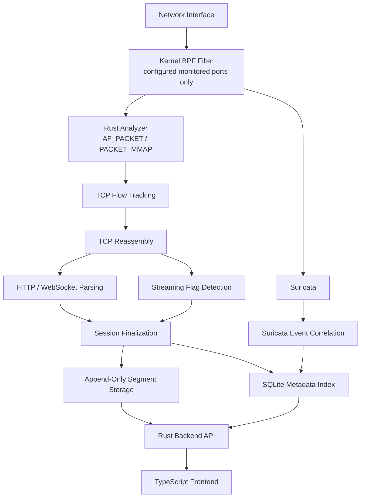

# Architecture

## High-Level Architecture



## Core Principle

Suricata and the Rust analyzer are parallel consumers of the relevant traffic.

Suricata must **not** sit in front of the Rust analyzer:

```text
BAD:

NIC
 -> Suricata
 -> JSON
 -> Rust analyzer
```

That would add unnecessary serialization, parsing, I/O, and coupling.

Preferred architecture:

```text
                 +-> Rust analyzer -> sessions
NIC -> filter ---+
                 +-> Suricata -----> alerts/enrichment
```

The Rust analyzer is the source of truth for reconstructed traffic sessions.

Suricata is an optional/parallel enrichment and IDS source.

## Capture Layer

### Requirements

- Linux only for the first implementation.
- Capture from a live interface.
- Use `AF_PACKET`.
- Prefer `PACKET_MMAP` / RX ring based capture to reduce syscall overhead.
- Capture filter must be installed in the kernel.
- Traffic outside configured monitored ports should not enter the application hot path.

### Source Configuration

A "source" is a user-visible monitored service definition, similar to Packmate.

Minimum fields:

```text
id
name
port
enabled
```

Example:

```text
web-service
port 8080

flag-service
port 9000
```

The effective BPF filter can be generated from enabled sources.

Example:

```text
tcp and (port 8080 or port 9000)
```

The exact implementation may use classic BPF/eBPF or library abstractions, but the filtering decision must happen before userspace packet processing.

### Current Capture Status

The implemented analyzer opens a nonblocking `AF_PACKET/SOCK_RAW` socket, binds it to `CAPTURE_INTERFACE`, enables kernel receive timestamps and attaches a generated classic BPF program with `SO_ATTACH_FILTER`. Source changes rebuild the socket and filter. Capture pauses when there are no enabled sources.

`PACKET_MMAP` is not implemented yet; the current path uses `recvmsg`. The parser supports untagged Ethernet frames carrying IPv4/TCP or IPv6/TCP without extension headers. VLAN tags, IP fragments and IPv6 extension-header walking remain deferred.

## Concurrency Model

The packet-processing hot path should avoid a global mutex.

Preferred conceptual design:

```text
NIC RX
  |
  v
capture
  |
  v
flow hash
  |
  +--> worker 0 -> local flow table
  +--> worker 1 -> local flow table
  +--> worker 2 -> local flow table
  +--> worker N -> local flow table
```

Packets belonging to one flow/session should consistently be handled by the same worker.

Possible flow key:

```text
src_ip
src_port
dst_ip
dst_port
protocol
```

Direction normalization should allow the same bidirectional TCP connection to resolve to one internal session identity.

The current implementation hashes normalized client/server endpoints into worker-local `HashMap` flow tables. Each worker has a bounded packet channel and a configurable active-flow limit.

### Backpressure

All inter-task channels on the ingest path must be bounded.

The application must prefer:

- observable drops
- explicit queue saturation
- bounded memory usage

over unbounded memory growth.

## TCP Reassembly

The analyzer must reconstruct two logical byte streams:

```text
client -> server
server -> client
```

Reassembly must account for at least:

- TCP sequence numbers
- out-of-order segments
- duplicate/retransmitted data
- connection close
- idle timeout
- partial/incomplete sessions

The session storage format should represent reconstructed bytes, not original packets.

The current assembler uses a bounded byte vector plus a `BTreeMap` for pending out-of-order ranges. It trims retransmitted overlap, finalizes on RST, both-direction FIN, or idle timeout, and marks timed-out, truncated or not-fully-closed sessions as incomplete. Behavior under very large gaps and long-lived connections still needs production policy and testing.

## Flag Detection

Flag scanning occurs on reconstructed stream data.

Do not search each raw packet independently.

Example failure mode of packet-level scanning:

```text
packet 1:  FLAG{ABC
packet 2:  DEF123}
```

A packet-level search misses the flag.

A stream-level search sees:

```text
FLAG{ABCDEF123}
```

Flag scanning should be streaming where practical.

Global configuration:

```text
FLAG_REGEX=<regex>
```

Per-session metadata:

```text
contains_flag: bool
flag_direction: none | c2s | s2c | both
flag_count: integer
```

The implementation performs incremental scans with a 4 KiB overlap and repeats an exact full-stream scan when the session is finalized. The per-direction stream size is bounded by `MAX_STREAM_BYTES`.

## Protocol Parsing

MVP:

### HTTP/1.x

Extract enough metadata for Packmate-like browsing:

- method
- host if available
- URI/path
- status code
- content type if available
- request/response direction
- request/response boundaries where possible

### WebSocket

Support:

- WebSocket upgrade detection
- frame extraction
- direction
- text/binary distinction where practical
- payload presentation in the session UI

Current status: HTTP Upgrade/101 traffic is classified as `websocket`, but WebSocket frames are not decoded yet.

### Raw TCP

If a session does not parse as HTTP/WebSocket, it must still remain available as a raw reconstructed TCP session.

## Suricata Integration

Suricata should receive the same monitored traffic independently.

Purpose:

- IDS alerts
- signatures
- protocol/security enrichment
- future triage features

Do not make Suricata output required for basic session capture.

If Suricata stops, the Rust analyzer should continue collecting sessions.

If the Rust analyzer stops, Suricata may continue independently.

### Correlation

Correlation mechanism is not fully fixed yet.

Preferred options to evaluate:

1. Community ID
2. normalized 5-tuple + timestamp window
3. another stable flow identifier if available

Do not invent a tight coupling before implementation evidence justifies it.

Store Suricata correlation as metadata, not inside payload segment records unless needed for recovery.

### Current Suricata Status

The Compose service runs Suricata passively on the configured interface and writes logs under `data/suricata`. It cannot block traffic in this mode. `SURICATA_BPF_FILTER` is currently a separate static expression and is not rebuilt from UI Sources. EVE ingestion, alert details and session correlation are not implemented; the SQLite/UI `suricata_alerts` field is a reserved placeholder and remains zero.

## API and UI Boundary

The Axum API exposes source CRUD, cursor-based session listing, individual session metadata, directional payload retrieval and flag-match ranges. Session listing supports metadata filters for source, flag presence, protocol, client/server IP and port, and start time. Pages are capped at 200 rows. Payload search is a byte-substring scan over at most 2,000 metadata-prefiltered candidates per request.

The React UI currently exposes source, protocol, flag-only and payload filters for sessions. Sources can be searched and sorted locally by name or TCP port. The UI is branded `Нюхач`; `newhatch` remains the internal repository/service name.

## Timestamp Model

Do not use "time when application logic happened" as the primary packet time.

Use receive/capture timestamps provided by the packet capture mechanism.

Session timestamps:

```text
started_at = first observed packet timestamp
ended_at   = last observed packet timestamp
```

Use a compact integer representation in storage, preferably Unix nanoseconds or microseconds.

The current implementation stores Unix microseconds. It uses the kernel receive timestamp when available and falls back to the current system time.

## Failure Isolation

The Rust analyzer should continue to function if:

- frontend is unavailable
- API client disconnects
- Suricata is unavailable
- SQLite readers are slow

The storage writer is critical and must fail loudly if it cannot persist new session records.

## Out of Scope

Do not design for:

- Kubernetes orchestration
- multi-node clustering
- HA databases
- distributed ingestion
- distributed storage
- enterprise SIEM integrations
- multi-tenant authentication
